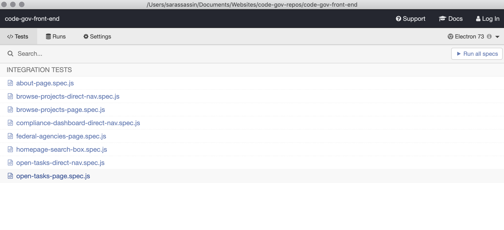
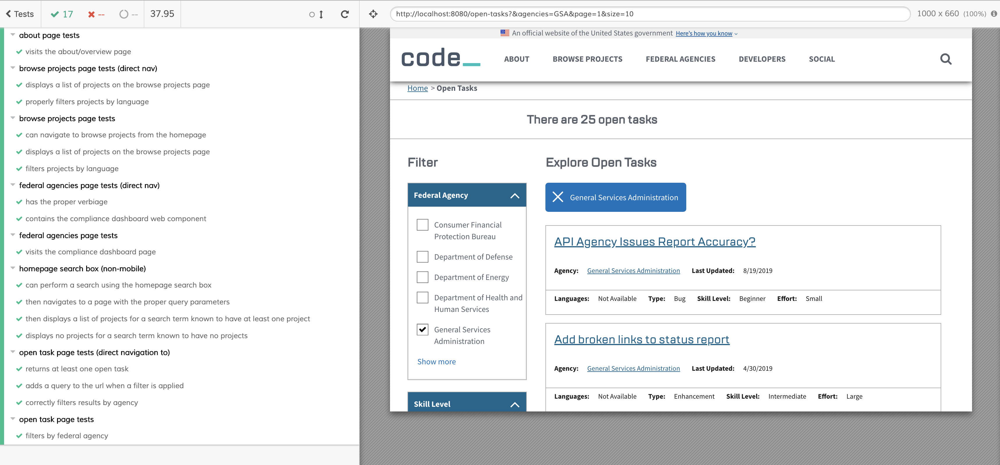

# Code.gov - Unlocking the potential of the Federal Government’s software.

[](https://circleci.com/gh/GSA/code-gov-front-end)
[](https://codeclimate.com/github/GSA/code-gov-front-end/maintainability)
[](https://github.com/facebook/jest)

## Introduction

[Code.gov](https://code.gov) is a website promoting good practices in code development, collaboration, and reuse across the U.S. Government. Code.gov provides tools and guidance to help agencies implement the [Federal Source Code Policy](https://sourcecode.cio.gov). It also includes an inventory of government custom code to promote reuse between agencies and provides tools to help government and the public collaborate on open source projects.

To learn more about the project, check out this [blog post](https://www.whitehouse.gov/blog/2016/08/08/peoples-code).

Code.gov is an open source project, so we invite your contributions, be it in the form of code, design, or ideas.

## Contributing

Here’s how you can help contribute to code.gov:

- Source Code Policy

  - To provide feedback on the [Federal Source Code Policy](https://sourcecode.cio.gov/), follow [this issue tracker](https://github.com/WhiteHouse/source-code-policy/issues)

- Code.gov
  - To provide feedback on code-gov-front-end, please checkout our [Contributing Guildelines](CONTRIBUTING.md).
  - To contribute to the Code.gov data, go to the [code-gov-data] repo at (https://github.com/GSA/code-gov-data)
  - Checkout [code-gov](https://github.com/GSA/code-gov) for a list of additional project repositories. If you aren't sure where your question or idea fits, this is a good place to share it.

## Getting Started

You will need node to run this website. It's built against v10.19.0. The best way to get node is to install it via `nvm`. See the [nvm installation instructions](https://github.com/nvm-sh/nvm/blob/master/README.md#installation-and-update) to set it up on your system.

After you have cloned this repo, you can use `npm install` to install all of the
project’s dependencies.

You can then run the server using `npm run start`.

By default, the development server will listen on <http://localhost:8080/>. You can change the default port by setting the `PORT` environment variable before starting the server (for example, `PORT=3000 npm start`).

### Specifying an API Key

The app uses the API key provided in the site.json by default.
If you want to override that, specify an `CODE_GOV_API_KEY` environmental variable. Here's an example:

```
CODE_GOV_API_KEY=l87sfdi7ybc2bic7bai8cb2i176c3b872tb3 npm run start
```

An alternate approach to using your API key every time you use `npm run start` is to create a `.env.local` file and store your API key. (Remember to use `CODE_GOV_API_KEY=...`) In accordance with [dotenv-flow](https://www.npmjs.com/package/dotenv-flow), your personal key will be ignored when committing updates to GH.

You can sign up for an [API key](https://open.gsa.gov/api/codedotgov/).

### File Structure

The directories in `src` are organized around the pillars of React, along
with several additional custom file types. When creating new files, be sure to
add your file and any necessary templates, styles, and tests to a directory
dedicated to your new file in the appropriate place.

### Testing

Unit testing is done using the [jest](https://github.com/facebook/jest) framework with [enzyme](https://github.com/airbnb/enzyme).

Use `npm run test` to run unit tests a single time. This will generate a code coverage report.

Use `npm run test-watch` to run unit tests continuously, re-running each time a file is saved. By default only files changed since the last commit will be ran, follow the command line prompt for customizing how tests are ran. Snapshot tests can be updated while running this command, by pressing `u` to updated them.

Note: console.log/warn/error are mocked in unit tests and will not print anything to avoid cluttering the command line. Use a different logging, such as console.info for debugging while running tests

Note: site should be running locally before executing npm run test or you might get false errors due to the component plugins being used

To run web accessibility testing do the following:
a. Make sure [ruby](https://www.ruby-lang.org/en/documentation/installation/) and the [bundler gem](https://bundler.io/) are installed on your computer.
b. Start a server by running `npm run start`.
c. Use the `npm run test-pa11y` command to run the accessibility tests.

Pa11y-ci uses URLs in the sitemap file to run tests against. It currently excludes anything in /projects. Since this is over 6000 items, it would take a long time to finish and just report the same issues over and over.
Additional accessibility testing configuration is located in the .pa11yci file. A select few projects are listed here as URL's to test. These are tested in addition to the sitemap.xml.
The `--sitemap-find` and `--sitemap-replace` commands allow us to scan the named pages in the sitemap, but test them locally against the server you are running on your machine.

We follow the WCAG2AA standard. For more info on the rules being tested checkout the [pa11y wiki](https://github.com/pa11y/pa11y/wiki/HTML-CodeSniffer-Rules)

End-to-end tests:  
We use Cypress to run end-to-end tests.  
To run Cypress testing do the following:  
a. Make sure you run `npm install` to install all of the
project’s dependencies.  
b. Start a server by running `npm run start`.  
c. Use the `npm run test:cypress` command to run the Cypress tests.

Once these steps are completed, you should see the list of spec files.



Click the `run all specs` button (in the upper right) to run the tests.



## Deployment

Read about how to publish to Github pages, Federalist and elsewhere [here](DEPLOYMENT.md)

## Bundle analysis

https://federalist-proxy.app.cloud.gov/preview/gsa/code-gov-front-end/federalist-bundle-analysis/report.html

## Deploying Arbitrary Branch

Coming soon!

## Generating License Data

To update the `dependency_licenses.json` file, run `npm run licenses`.

## Configuration

For documentation on how to configure code-gov-front-end, read [here](CONFIGURATION.md).

## Questions?

If you have questions, please feel free to contact us:  
[Open an issue](https://github.com/GSA/code-gov-front-end/issues)  
[LinkedIn](https://www.linkedin.com/company/code-gov/)  
[Twitter](https://twitter.com/@CodeDotGov)  
[Email](mailto:code@gsa.gov)

Or join our `#opensource-public` channel on Slack: https://chat.18f.gov/

## License

As stated in [CONTRIBUTING](CONTRIBUTING.md):

> [..] this project is in the worldwide public domain (in the public domain within the United States, and copyright and related rights in the work worldwide are waived through the [CC0 1.0 Universal public domain dedication](https://creativecommons.org/publicdomain/zero/1.0/)).

> All contributions to this project will be released under the CC0
> dedication. By submitting a pull request, you are agreeing to comply
> with this waiver of copyright interest.
